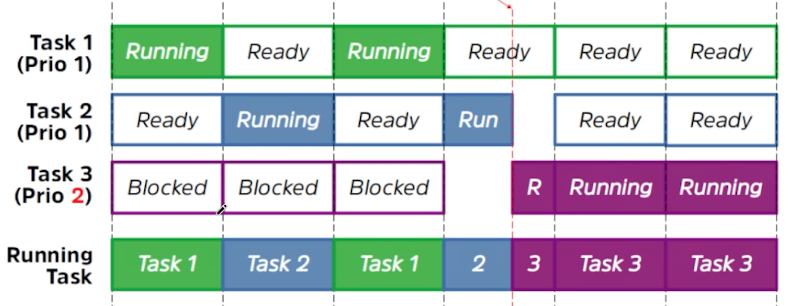
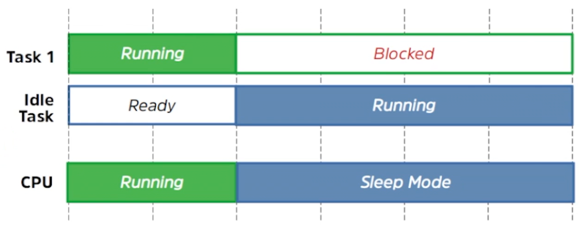
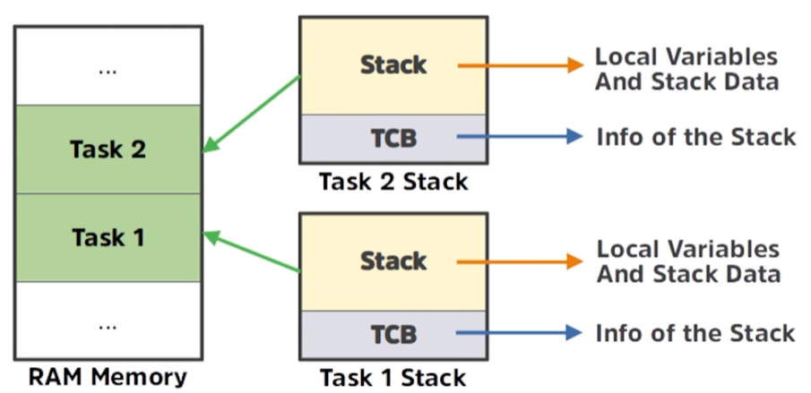
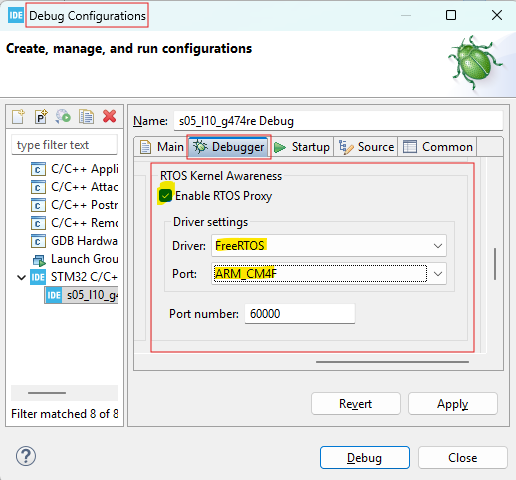
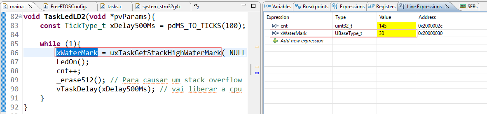
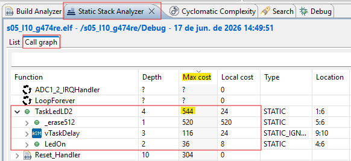
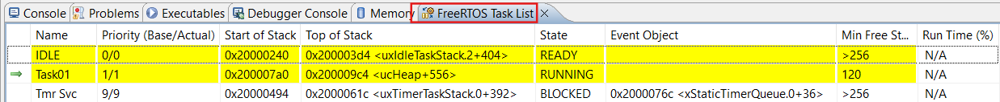

# Tarefas

Este módulo foca no coração do FreeRTOS: como as tarefas são estruturadas, priorizadas e gerenciadas pelo kernel para permitir o multitarefa em microcontroladores.

## Tarefas (Tasks/Threads)
No FreeRTOS, uma aplicação é organizada como um conjunto de **tarefas independentes**, cada uma executando em seu próprio contexto sem dependência direta de outras. 
*   **Implementação:** As tarefas são funções C que **nunca devem retornar**; por isso, são normalmente implementadas como um laço infinito (`for(;;)` ou `while(1)`).
*   **Assinatura:** Devem seguir o protótipo `void vATaskFunction( void * pvParameters )`, retornando `void` e aceitando um ponteiro para `void` como parâmetro.
*   **Estados:** Uma tarefa pode estar em um de quatro estados principais: **Execução (Running)**, **Pronta (Ready)**, **Bloqueada (Blocked)** ou **Suspensa (Suspended)**. Quando uma tarefa é criada, ela entra inicialmente no estado "Pronta".

    

      
    

## Escalonador (Scheduler) e Task Switching
O **Escalonador** é o componente do kernel responsável por decidir qual tarefa no estado "Pronta" deve entrar no estado de "Execução".
*   **Política de Escalonamento:** Por padrão, o FreeRTOS utiliza um algoritmo **preemptivo por prioridade com compartilhamento de tempo (time slicing)**. Isso significa que a tarefa de maior prioridade sempre terá preferência, e tarefas de mesma prioridade dividirão o tempo de CPU.
*   **Troca de Contexto (Task Switching):** Quando o escalonador decide trocar a tarefa ativa, ocorre o "chaveamento de contexto". O contexto da tarefa atual (registradores da CPU) é salvo em sua própria pilha, e o contexto da nova tarefa é restaurado a partir da pilha dela, permitindo que a execução continue exatamente de onde parou.

## 3. API de Task

Para ter acesso as rotinas das tasks do FreeRTOS é necessários incluir no arquivo de *header*:
~~~c
#include <task.h>
~~~

As principais funções para gerenciar o ciclo de vida das tarefas incluem:

*   **`xTaskCreate()`**: Cria uma nova tarefa com alocação dinâmica de memória para o TCB (*Task Control Block*) e para a pilha.
*   **`xTaskCreateStatic()`**: Cria uma tarefa usando blocos de memória RAM pré-alocados pelo desenvolvedor, útil em sistemas que proíbem alocação dinâmica.
*   **`vTaskDelete()`**: Remove uma instância de tarefa do kernel, libera os recursos alocados internamente pelo kernel (TCB e pilha) e encerra sua execução.
*   **`vTaskDelay()`**: Coloca a tarefa no estado **"Bloqueado"** por um número específico de *ticks* a partir do momento em que a função foi chamada, liberando o processador para outras tarefas.
*   **`vTaskDelayUntil()`**: Coloca a tarefa no estado **"Bloqueado"** até que um tempo **absoluto** seja atingido. Diferente da `vTaskDelay()`, que é relativa ao momento da chamada, esta função é utilizada para garantir uma **frequência de execução constante**, pois calcula o próximo tempo de desbloqueio com base em um ponto de referência anterior.
*   **`xTaskAbortDelay()`**: Ela força uma tarefa a sair do estado Bloqueado (Blocked) e entrar no estado Pronto (Ready), mesmo que o evento pelo qual a tarefa estava esperando não tenha ocorrido ou o tempo de atraso (timeout) especificado ainda não tenha expirado.
*   **`vTaskSuspend()`**: Coloca uma tarefa no estado **"Suspenso"**. Uma tarefa suspensa torna-se indisponível para o escalonador e nunca entrará no estado de "Execução" até que seja explicitamente retomada. Uma tarefa pode suspender a si mesma passando `NULL` como handle.
*   **`vTaskResume()`**: Faz a transição de uma tarefa do estado **"Suspenso"** de volta para o estado **"Pronto"**. Esta função é o único meio (junto com sua versão para interrupções) de tirar uma tarefa do estado suspenso, permitindo que ela volte a ser considerada pelo escalonador para execução.

## Prioridades de Tarefas
Cada tarefa recebe uma prioridade no momento de sua criação, que pode ser alterada dinamicamente.
*   **Escala:** As prioridades variam de **0 (mínima)** até **`configMAX_PRIORITIES - 1` (máxima)**.
*   **Regra de Ouro:** O escalonador sempre garante que a tarefa de maior prioridade capaz de rodar seja aquela que recebe o tempo de processamento. Se uma tarefa de maior prioridade se torna "Pronta", ela **preempta** imediatamente uma tarefa de menor prioridade que esteja rodando.

    

      
    

## Idle Task e Hooks
A **Tarefa Ociosa (Idle Task)** é criada automaticamente pelo kernel quando o escalonador é iniciado. Garante que sempre haja pelo menos uma tarefa pronta para executar. Ela roda na prioridade mais baixa (0) e é encarregada de liberar a memória de tarefas que foram deletadas.

*   **Idle Hook:** É uma função de *callback* opcional (`vApplicationIdleHook`) que o desenvolvedor pode definir para ser executada em cada iteração da Idle Task. É ideal para colocar o processador em modo de **baixo consumo** ou executar processamentos de fundo muito leves.

    

      
    

* **Nota:** Não é recomentado, mas caso queira implementar uma outra tarefa com prioridade Idle (0), é importante que em `FreeRTOSConfig.h` a macro `configIDLE_SHOULD_YIELD` esteja definida como `1`. 

* As seguintes macro referem-se a ***hooks*** (ganchos), que permitem ao desenvolvedor inserir códigos personalizados em eventos específicos do kernel. Quando qualquer uma delas é definida como 1, o programador é responsável por fornecer a implementação da função correspondente.

  *   **`configUSE_IDLE_HOOK`**: Define se a função de gancho da tarefa ociosa (`vApplicationIdleHook`) será utilizada. Quando habilitada, esta função é chamada repetidamente em cada iteração da *Idle Task*.
  
  *   **`configUSE_TICK_HOOK`**: Habilita a função de gancho de interrupção de tick (`vApplicationTickHook`). Esta função é chamada pelo kernel durante cada **interrupção de tick** do sistema. Por ser executada dentro do contexto de uma interrupção de hardware, ela deve ser extremamente curta, usar pouca pilha e chamar apenas funções da API do FreeRTOS que terminam com "FromISR".

  *   **`configUSE_MALLOC_FAILED_HOOK`**: Ativa o gancho para falhas na alocação de memória (`vApplicationMallocFailedHook`). Esta função é disparada automaticamente se a função `pvPortMalloc()` (usada internamente pelo kernel ao criar tarefas, filas ou semáforos) retornar `NULL` devido à falta de memória no *heap*. É essencial para depuração e para notificar o desenvolvedor sobre o esgotamento de recursos de memória RAM.

  *   **`configUSE_DAEMON_TASK_STARTUP_HOOK`**: Quando esta macro e a `configUSE_TIMERS` estão ambas em 1, o kernel chamará a função `vApplicationDaemonTaskStartupHook` exatamente **uma única vez**. Isso ocorre quando a tarefa de serviço de timers (*Daemon Task*) começa a ser executada pela primeira vez. É o local apropriado para colocar códigos de inicialização que dependem do RTOS já estar em funcionamento.

  * **`configCHECK_FOR_STACK_OVERFLOW`**: Usada para habilitar mecanismos opcionais que auxiliam na detecção e depuração de estouros de pilha (*stack overflows*). Se a macro for definida como 1 ou 2, o desenvolvedor deve fornecer uma função de gancho chamada `vApplicationStackOverflowHook`. A configuração desta macro funciona através de diferentes métodos:

    *   **Valor 0 (Desabilitado):** O kernel não realiza nenhuma verificação de estouro de pilha. Este valor é frequentemente usado em versões finais de produção para economizar tempo de processamento, já que a verificação aumenta o tempo necessário para realizar uma troca de contexto.
    *   **Valor 1 (Método 1):** O kernel verifica se o **ponteiro de pilha** (*stack pointer*) permanece dentro dos limites válidos no momento em que o contexto da tarefa é salvo durante uma troca de contexto. É um método rápido, mas pode não capturar estouros que ocorrem entre as trocas de contexto.
    *   **Valor 2 (Método 2):** Realiza as mesmas verificações do Método 1 e adicionalmente verifica se um **padrão conhecido** (gravado no final da pilha quando a tarefa foi criada) foi sobrescrito. Ele testa os últimos 20 bytes da pilha. Embora seja um pouco mais lento que o Método 1, é mais eficaz na detecção.
    *   **Valor 3 (Método 3):** Disponível apenas em alguns portes específicos, habilita a verificação da pilha de interrupções. Se um estouro for detectado, um *assert* é disparado em vez de chamar a função de gancho (*hook*).

## Stack Size
Cada tarefa possui sua própria pilha, usada para variáveis locais e armazenamento de contexto.

  

    
  

*   **Definição:** Ao criar uma tarefa, o parâmetro `usStackDepth` define o tamanho da pilha.
*   **Unidade:** O valor é especificado em **palavras (words)**, não em bytes. Por exemplo, em um STM32 (arquitetura de 32 bits), uma pilha de 100 palavras ocupará 400 bytes.
*   **`configMINIMAL_STACK_SIZE`**: Define o tamanho mínimo recomendado para qualquer tarefa naquela arquitetura específica.
*   **Monitoramento:** A função `uxTaskGetStackHighWaterMark()` pode ser usada para verificar o quão perto a tarefa chegou de estourar sua pilha, retornando o espaço mínimo restante desde o início da tarefa. Para utiliza-lá, a macro `INCLUDE_uxTaskGetStackHighWaterMark` ser definida como `1` no arquivo `FreeRTOSConfig.h`. No STM32CubeIDE, o debug pode ser configurado da seguinte forma: 

  

    
    
  

* No STM32CubeIDE, o **Static Stack Analyzer** é uma ferramenta que estima o uso máximo de pilha (stack) de uma aplicação por meio de análise estática do código, sem precisar executar o programa. Ela percorre a cadeia de chamadas de funções (call graph) e calcula quanto de stack cada função consome, somando esse consumo ao longo dos caminhos de execução possíveis.

  

    
  

  

    
  

## Exercícios do modulo:
| Aula | Exercícios |
|:--:|:--|
| 24 | [`s05_l1_g474re`](/projects/s05_l1_g474re/) , [`s05_l2_g474re`](/projects/s05_l2_g474re/) e [`s05_l3_g474re`](/projects/s05_l3_g474re/).|
| 26 | [`s05_l4_g474re`](/projects/s05_l4_g474re/) |
| 28 | [`s05_l5_g474re`](/projects/s05_l5_g474re/),  [`s05_l6_g474re`](/projects/s05_l6_g474re/) e [`s05_l7_g474re`](/projects/s05_l7_g474re/)|
| 30 | [`s05_l8_g474re`](/projects/s05_l8_g474re/), [`s05_l9_g474re`](/projects/s05_l9_g474re/) e [`s05_l10_g474re`](/projects/s05_l10_g474re/)|

## Referencias
- [Task Creation](https://www.freertos.org/Documentation/02-Kernel/04-API-references/01-Task-creation/01-xTaskCreate)
- [Task Control](https://www.freertos.org/Documentation/02-Kernel/04-API-references/02-Task-control/00-Task-control)
- [Task Utilities](https://www.freertos.org/Documentation/02-Kernel/04-API-references/03-Task-utilities/00-Task-utilities)
- [Hook Functions](https://www.freertos.org/Documentation/02-Kernel/02-Kernel-features/12-Hook-functions#idle-hook-function/)
- [ FreeRTOS stack usage and stack overflow checking](https://www.freertos.org/Documentation/02-Kernel/02-Kernel-features/09-Memory-management/02-Stack-usage-and-stack-overflow-checking)