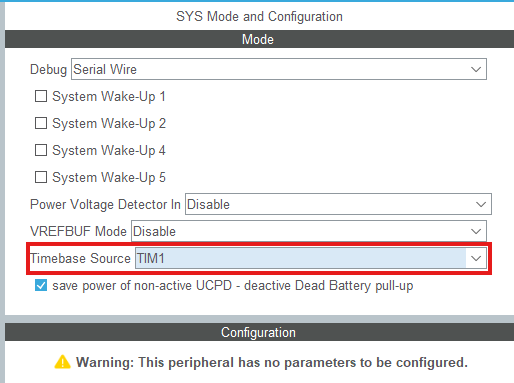
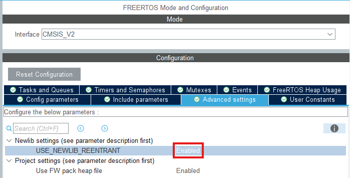
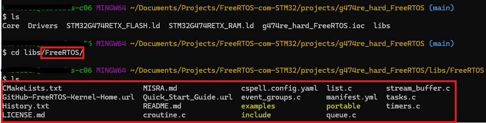
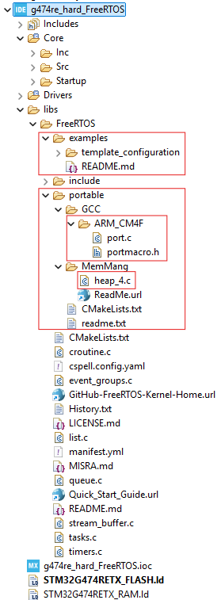
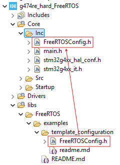
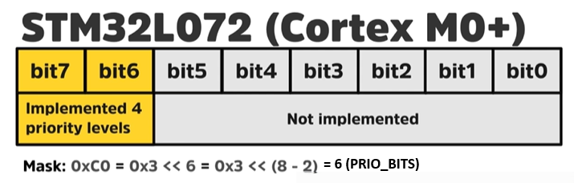

# Guia de Instalação: FreeRTOS no STM32

## Método 1: Modo Fácil (via STM32CubeIDE com CMSIS-RTOS)

Este método utiliza o ecossistema da STMicroelectronics para configurar o kernel automaticamente através de uma camada de abstração. No STM32Cube firmware, o FreeRTOS é utilizado por meio da camada de encapsulamento genérica **CMSIS-OS** fornecida pela Arm®.

  

### Passo-a-passo:
1.  **Habilitação no Device Configuration Tool (.ioc):** No STM32CubeMX, abra o arquivo de configuração de hardware e procure pela seção de Middleware. Selecione **FREERTOS** e escolha a versão da API (ex: CMSIS_V2).

  

2.  **Configuração Crítica do Timebase:** 
    *   Acesse **SYS Mode Configuration**.
    *   **Importante:** Altere o **Timebase Source** para um Timer diferente do **SysTick** (como o TIM1). O SysTick deve ser de uso exclusivo do FreeRTOS para o escalonamento.

  

  
  

3.  **Configurações Avançadas:** Nas "Advanced settings", certifique-se de que a opção **USE_NEWLIB_REENTRANT** esteja habilitada para garantir a segurança em bibliotecas padrão C.

  

  
  

  
---

## Método 2: Modo Manual ("Hard Mode")

Este método é ideal para quem deseja controle total sobre a versão do kernel e a estrutura de diretórios, importando o código diretamente do repositório oficial.

### 1. Preparação do Projeto e Hardware
*   Crie um novo projeto no **STM32CubeIDE**.
*   Assim como no modo fácil, vá em **SYS Mode Configuration** e altere o **Timebase Source** para um timer que não seja o SysTick.

### 2. Download do FreeRTOS
*   Acesse o [GitHub oficial do FreeRTOS](https://github.com/FreeRTOS/FreeRTOS-Kernel) e baixe ou clone o kernel.
*   Copie a pasta do kernel para dentro do diretório do seu projeto STM32.

  

  
  

*   **Dica:** Para evitar erros de compilação, delete ou configure o compilador para ignorar as pastas `cmake_example` e `coverity` dentro do diretório `/examples`.

### 3. Ajuste do diretório `/portable`
O diretório `/portable` contém arquivos específicos para diversos compiladores e arquiteturas. Para o STM32 no CubeIDE, faça o seguinte:
*   **Mantenha apenas o compilador GCC**, removendo todos os outros (IAR, Keil, etc.).
*   **Arquitetura:** Como o STM32 (ex: NUCLEO-L476RG e o NUCLEO-G474RE) utiliza ARM Cortex-M4 com FPU, mantenha apenas a pasta **ARM_CM4F** dentro de `/portable/GCC`.
*   **Gerenciamento de Memória:** Dentro de `/portable/MemMang`, mantenha apenas o arquivo **heap_4.c**, que é o gerenciador recomendado para a maioria das aplicações.

  

    
  

### 4. Configuração de Caminhos (Paths) no IDE
Para que o compilador encontre o FreeRTOS, acesse as **Properties** do projeto:
*   **Source Location:** Vá em `C/C++ General > Path and Symbols` e adicione o diretório onde o FreeRTOS foi baixado.

  

*   **Includes:** Na mesma tela, aba "Includes", adicione os caminhos para:
    *   `${ProjName}/libs/FreeRTOS/include`
    *   `${ProjName}/libs/FreeRTOS/portable/GCC/ARM_CM4F` (ou a pasta da sua arquitetura específica).

  

### 5. Configuração do `FreeRTOSConfig.h`
Este arquivo é o cérebro da configuração do kernel.
*   Copie o arquivo template localizado em `/examples/template_configuration` para a pasta `/Core/Inc` do seu projeto.

  

    
  

*   **Ajustes necessários no arquivo:**
    *   **`configCPU_CLOCK_HZ`**: Define a frequência do clock (em Hz) que alimenta o periférico responsável por gerar a interrupção periódica de *tick* do kernel.
        *   Em projetos STM32, a variável `SystemCoreClock` é fornecida pelos drivers CMSIS/HAL e contém o valor atualizado do clock da CPU (HCLK).
        *   Importe o header do seu microcontrolador (ex: `stm32l476xx.h` ou `stm32g4xx.h`) para que o FreeRTOS tenha acesso à variável `SystemCoreClock`. Use a mesma para defina o valor da macro `configCPU_CLOCK_HZ` de seguinte forma:

            ~~~c
            /* STM32 Includes*/
            #include "stm32g4xx.h"
            #include "stdint.h"

            /* Externs*/
            extern uint32_t SystemCoreClock;

            /******************************************************************************/
            /* Hardware description related definitions. **********************************/
            /******************************************************************************/

            // ...

            #define configCPU_CLOCK_HZ    ( ( unsigned long ) SystemCoreClock )
            ~~~

    *   **`configUSE_TIME_SLICING`**: Controla se o escalonador deve alternar entre tarefas de mesma prioridade a cada interrupção de *tick*.
        * Habilite o *time slicing* atribuindo a essa macro o valor `1`.
        * Isso permite que várias tarefas prontas com a mesma prioridade dividam o processador de forma justa (*Round Robin*), executando por um período de *tick* cada uma.

    *   **`configTICK_TYPE_WIDTH_IN_BITS`**: Define o tipo de dado e a largura de bits da variável `TickType_t`, que armazena a contagem total de *ticks* do sistema.
        * Defina essa macro como `TICK_TYPE_WIDTH_32_BITS` para microcontroladores de 32 bits como o STM32. 

    *   **`configCHECK_HANDLER_INSTALLATION`**: Habilita verificações internas (asserts) para validar se os manipuladores de interrupção do FreeRTOS (como `vPortSVCHandler` e `xPortPendSVHandler`) foram instalados corretamente no microcontrolador.
        * Defina essa macro como `0` para ser utiliza "Roteamento Indireto" de interrupções, ou seja, quando o desenvolvedor mapeia manualmente as funções no arquivo de interrupções (`stm32xxxx_it.c`) em vez de deixar o kernel assumir o 

    *   **`configPRIO_BITS`**: Irá especifica o número de bits que o hardware do microcontrolador (NVIC) utiliza para representar os níveis de prioridade de interrupção.
        * Crie a macro `configPRIO_BITS` da seguinte forma:
          ~~~c
          /* Cortex-M specific definitions*/
          #ifdef __NVIC_PRIO_BITS
            #define configPRIO_BITS		__NVIC_PRIO_BITS
          #else
            #define configPRIO_BITS		4
          #endif

          // ...
          #define configLIBRARY_LOWEST_INTERRUPT_PRIORITY   		15
          // ...
          #define configLIBRARY_MAX_SYSCALL_INTERRUPT_PRIORITY 	5
          ~~~

        * A `__NVIC_PRIO_BITS` é definida no arquivo de cabeçalho do CMSIS específico do chip. No caso do STM32L4, o hardware geralmente utiliza 4 bits, o que resulta em 16 níveis de prioridade de interrupção configuráveis.

        

          
        

  * `configKERNEL_INTERRUPT_PRIORITY`, `configMAX_SYSCALL_INTERRUPT_PRIORITY` e `configMAX_API_CALL_INTERRUPT_PRIORITY`: A primeira macro define a prioridade de interrupção usada pelo próprio kernel para o tick do sistema e para interrupções de troca de contexto. A segunda estabelece o nível máximo de prioridade a partir do qual as funções da API do FreeRTOS que terminam em "FromISR" podem ser chamadas com segurança. E a terceira macro é simplesmente um novo nome para `configMAX_SYSCALL_INTERRUPT_PRIORITY`, introduzido em versões e ports mais recentes do FreeRTOS.
      * Defina essas macros da seguinte forma:
        ~~~c
        #define configKERNEL_INTERRUPT_PRIORITY          ( configLIBRARY_MAX_SYSCALL_INTERRUPT_PRIORITY << (8 - configPRIO_BITS) ) 

        #define configMAX_SYSCALL_INTERRUPT_PRIORITY     ( configLIBRARY_MAX_SYSCALL_INTERRUPT_PRIORITY << (8 - configPRIO_BITS) ) 

        #define configMAX_API_CALL_INTERRUPT_PRIORITY    configMAX_SYSCALL_INTERRUPT_PRIORITY
        ~~~

### 6. Mapeamento de Interrupções
O FreeRTOS precisa assumir o controle de três interrupções fundamentais do processador. No arquivo `stm32l4xx_it.c`, localize e chame os handlers do FreeRTOS dentro das funções de interrupção padrão:

*   **SVC_Handler:** Chame `vPortSVCHandler()`.
*   **PendSV_Handler:** Chame `xPortPendSVHandler()`.
*   **SysTick_Handler:** Chame `xPortSysTickHandler()`.

Esses protótipos de funções de exceção estão localizados no arquivo `port.c` dentro da pasta da sua arquitetura em `/portable/GCC/`.